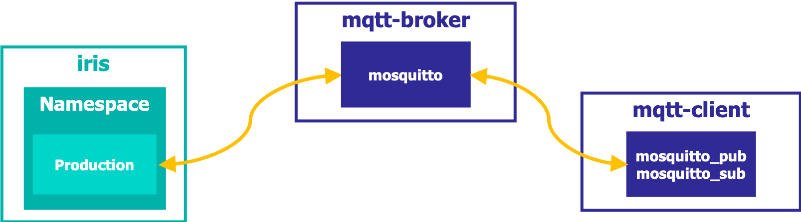

# Workshop: MQTT
This repository contains the materials and some examples you can use to learn the basic concepts of MQTT Adapters in IRIS Interoperability. 

You can find more in-depth information in https://learning.intersystems.com.

New to IRIS Interoperability framework? Have a look at [IRIS Interoperability Intro Workshop](https://github.com/intersystems-ib/workshop-interop-intro).

# What do you need to install? 
* [Git](https://git-scm.com/downloads) 
* [Docker](https://www.docker.com/products/docker-desktop) (if you are using Windows, make sure you set your Docker installation to use "Linux containers").
* [Docker Compose](https://docs.docker.com/compose/install/)
* [Visual Studio Code](https://code.visualstudio.com/download) + [InterSystems ObjectScript VSCode Extension](https://marketplace.visualstudio.com/items?itemName=daimor.vscode-objectscript)

# Setup
Build the image we will use during the workshop:

```console
$ git clone https://github.com/intersystems-ib/workshop-mqtt
$ cd workshop-mqtt
$ docker-compose build
```

# Examples



## (a). MQTT interoperability Production
* Run the containers we will use in the workshop:
```
docker-compose up
```
* Open the [Management Portal](http://localhost:52773/csp/sys/UtilHome.csp).
* Login using the default `superuser`/ `SYS` account.
* Click on [MQTT.Prod](http://localhost:52773/csp/user/EnsPortal.ProductionConfig.zen?PRODUCTION=MQTT.Prod) to access the sample interoperability production we will use. You can access also through *Interoperability > User > Configure > Production*.


## (b). Publish a message using MQTT operations
* In a VS Code Terminal window, type the following to *subscribe* to `iris/out/#` topic in the `mqtt-client` container:
```console
docker exec -it mqtt-client bash
# mosquitto_sub -h mqtt-server -t "iris/out/#"
``` 
* In the [MQTT.Prod](http://localhost:52773/csp/user/EnsPortal.ProductionConfig.zen?PRODUCTION=MQTT.Prod) interoperability production, click on the pre-built passthrough `EnsLib.MQTT.Operation.Passthrough` operation. Go through the *Settings* tab. Pay attention to `ClientId`, `KeepAlive`, `Url`, `ReplyCodeActions`, `RetryInterval`, `FailureTimeout`.
* Go to *Actions tab > Test*, enter some text in the *StringValue* field, and use `iris/out/passthrough` as topic.
* Check the resulting Visual Trace.
* Check that in your Terminal window where you subscribed to `iris/out/#` topic you received the message.
* In your `docker-compose up` terminal, try to find a message like:
```
mqtt-server    | 1599551296: New client connected from 192.168.48.4 as iris-passthrough-bo (p2, c1, k15).
mqtt-server    | 1599551319: Client iris-passthrough-bo has exceeded timeout, disconnecting.
```
* Send another test message from `EnsLib.MQTT.Operation.Passthrough` operation. Why is the trace different this time?
* Back in [MQTT.Prod](http://localhost:52773/csp/user/EnsPortal.ProductionConfig.zen?PRODUCTION=MQTT.Prod), click on the (+) icon on Business Operation and add `MQTT.BO.MQTTOperation`.
* In VS Code, have a look at the [MQTTOperation](iris/src/MQTT/BO/MQTTOperation.cls) Business Operation. It is a simple Business Operation that uses MQTT outbound adapter.
* Configure the MQTT Settings of `MQTT.BO.MQTTOperation` properly (see `EnsLib.MQTT.Operation.Passthrough`).
* Test the `MQTT.BO.MQTTOperation` in the production using `iris/out/test` topic.

## (c). Add a Business Process into the mix
* Let's simulate a Business Process asking for some information to Business Operation, and then transforming the result into a MQTT message.
* Add a new Business Operation, choose `MQTT.BO.DummyData`. It's a simple Business Operation that returns some random output, have a look at the code at [DummyData](iris/src/MQTT/BO/DummyData.cls). Test it and see how it behaves.
* Now add a Business Process, choose `MQTT.BP.Process`. In the *Settings* tab, click on the magnifying glass icon on the *Class Name* property, go through the details of the implementation, try to understand what it will do.
* Test the `MQTT.BP.Process` Business Process in the production and see what happens.

## (d). Add a MQTT Business Service to receive messages
* Now we will listen to MQTT messages published to `iris/in/#` topic.
* You could use a straight forward pre-built passthrough service: `EnsLib.MQTT.Service.PassThrough`, however we will add a service that uses MQTT adapters too to see them in action.
* Add a new Business Service, choose `MQTT.BS.Service`. Have a look at the code in [MQTT.BS.Service](iris/src/MQTT/BS/MQTTService.cls).
* Configure the *MQTT Settings* to connect to your `mqtt-broker` listening to `iris/in/#` topic. 
* Now, open a new VS Code Terminal and type the following to publish a message into `iris/in/test` topic using the mqtt-client container:
```console
docker exec -it mqtt-client bash
# mosquitto_pub -h mqtt-server -t "iris/in/test" -m "sample message!"
``` 


